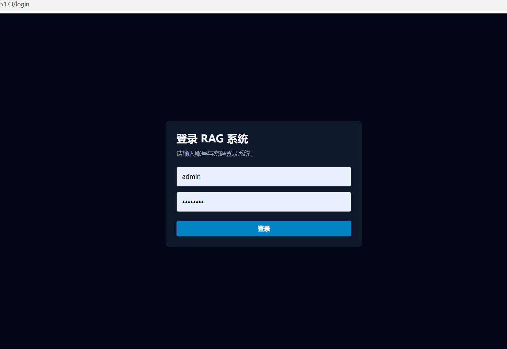
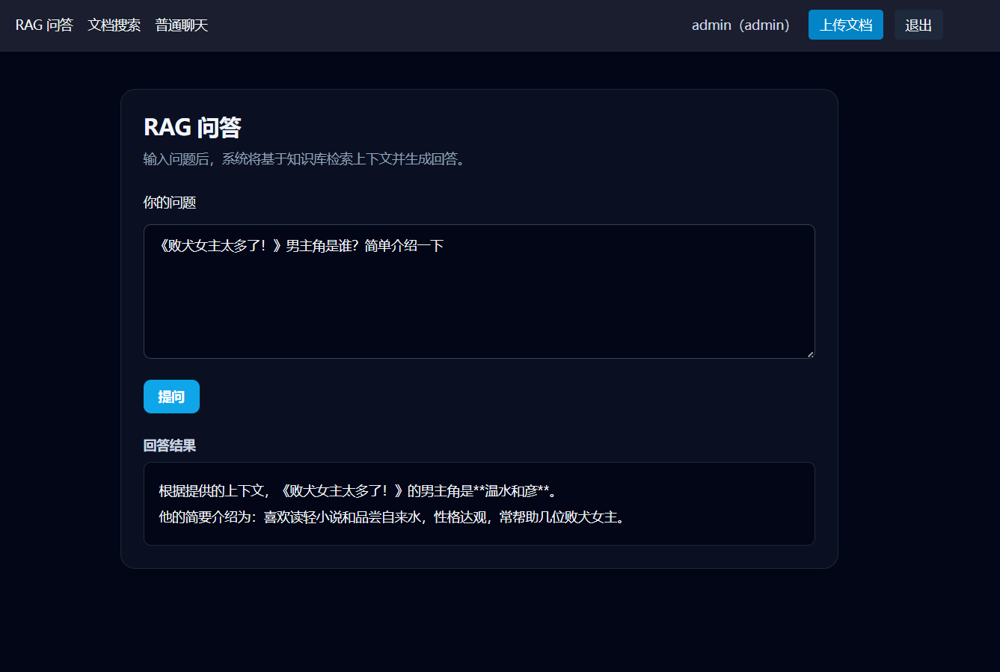
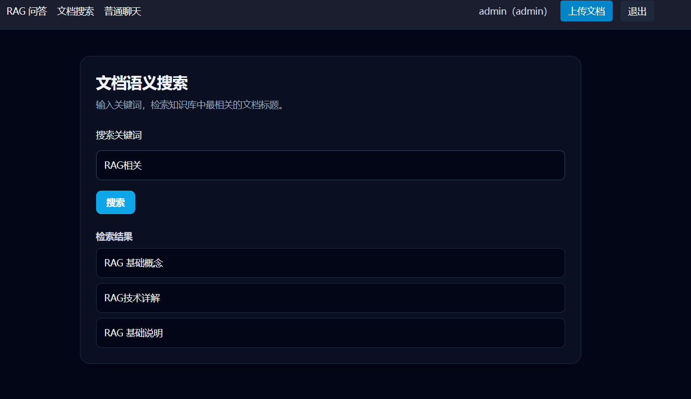
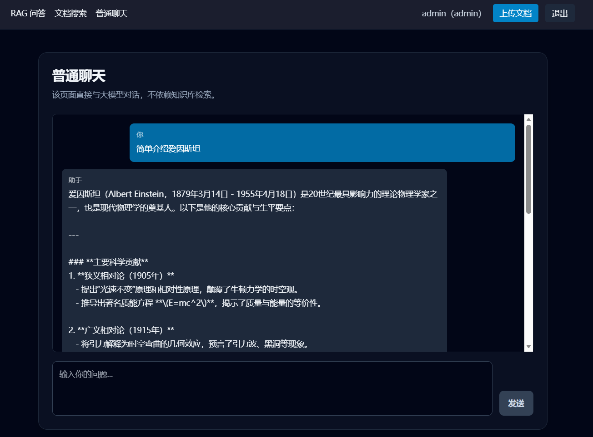
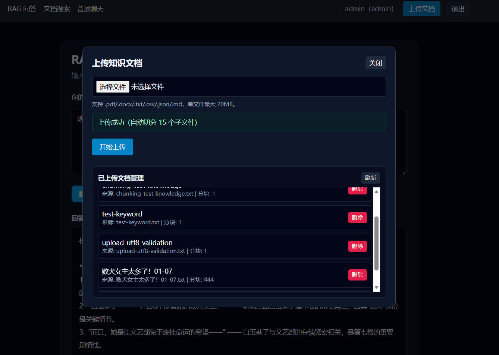
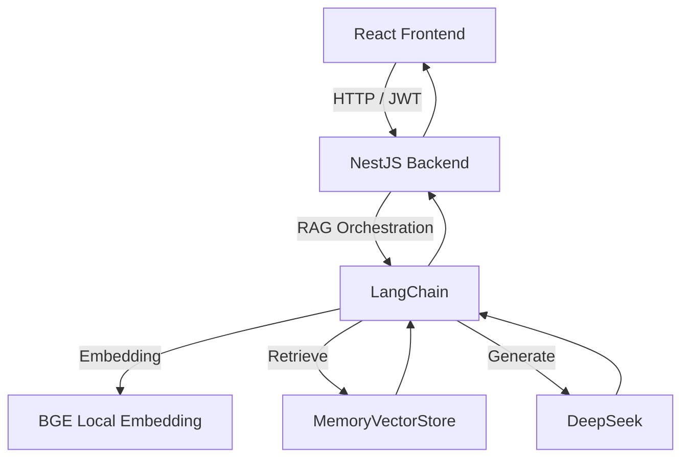
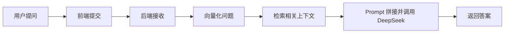

# RAG QA System

**一个可落地的 RAG 问答系统**  
支持知识库增强问答、文档语义搜索、流式聊天、JWT 认证与管理员文档管理。


## 🖼️ 界面预览


### 登录页面


### RAG 问答页面


### 文档搜索页面


### 普通聊天页面


### 管理员上传界面



## 📚 目录

- [📌 项目简介](#-项目简介)
- [✨ 核心特性](#-核心特性)
- [🧰 技术栈](#-技术栈)
- [🏗️ 系统架构](#️-系统架构)
- [🚀 快速开始](#-快速开始)
- [🔐 环境变量说明](#-环境变量说明)
- [🧭 使用指南](#-使用指南)
- [📁 项目结构](#-项目结构)
- [🛣️ Roadmap](#️-roadmap)
- [🤝 贡献指南](#-贡献指南)
- [📄 许可证](#-许可证)

## 📌 项目简介

这是一个基于 `React + NestJS + LangChain` 的全栈 RAG 项目，核心目标是让大模型回答建立在可检索的知识库上下文之上。

适用场景：

- 企业内部知识问答机器人
- 运维/客服 SOP 检索与问答
- 低成本私有知识库问答 MVP

## ✨ 核心特性

- **RAG 智能问答**：问题向量化后检索知识片段，再由 LLM 生成回答。
- **文档语义搜索**：支持关键词与语义召回，返回相关文档标题。
- **流式普通聊天**：SSE 实时输出模型回复。
- **认证与权限**：JWT 鉴权 + 角色控制（管理员/普通用户）。
- **知识库管理**：管理员可上传、查看、删除知识文档。
- **上传持久化**：已上传文档持久化到磁盘，服务重启后自动恢复。
- **本地 Embedding**：使用本地 BGE 模型，降低第三方 API 依赖与成本。

## 🧰 技术栈

### 前端


| 技术           | 说明            |
| ------------ | ------------- |
| React        | UI 渲染与组件化开发   |
| TypeScript   | 类型约束与可维护性     |
| Vite         | 开发服务器与构建工具    |
| Zustand      | 全局状态管理（含认证状态） |
| Tailwind CSS | 原子化样式体系       |
| React Router | 路由与受保护页面      |
| Axios        | HTTP 请求与拦截器   |


### 后端


| 技术                       | 说明                |
| ------------------------ | ----------------- |
| NestJS                   | 模块化后端框架           |
| TypeScript               | 类型安全与工程规范         |
| LangChain                | RAG 链路编排          |
| DeepSeek API             | 大模型推理             |
| HuggingFace Transformers | 本地 Embedding 模型加载 |


### 向量存储


| 组件                | 说明         |
| ----------------- | ---------- |
| MemoryVectorStore | 演示阶段向量检索存储 |


## 🏗️ 系统架构

整体链路：`React 前端 -> NestJS 后端 -> LangChain -> DeepSeek + MemoryVectorStore`



RAG 流程（简化）：



## 🚀 快速开始

### 前置要求

- Node.js >= 18
- npm >= 9
- DeepSeek API Key

### 1) 克隆项目

```bash
git clone <your-repo-url>
cd rag-qa-system
```

### 2) 安装依赖

```bash
cd backend && npm install
cd ../frontend && npm install
```

### 3) 配置环境变量

```bash
cd ../backend
cp .env.example .env
```

至少配置：

- `DEEPSEEK_API_KEY`
- `DEEPSEEK_MODEL`
- `DEEPSEEK_BASE_URL`
- `HF_ENDPOINT`

### 4) 启动后端

```bash
cd backend
npm run start:dev
```

### 5) 启动前端

```bash
cd frontend
npm run dev
```

访问地址：

- 前端：`http://localhost:5173`
- 后端：`http://localhost:3010`

默认账号：

- 管理员：`admin / admin123`
- 普通用户：`user / user123`

## 🔐 环境变量说明

以 `backend/.env.example` 为准：


| 变量名                 | 说明                      |
| ------------------- | ----------------------- |
| `DEEPSEEK_API_KEY`  | DeepSeek API 密钥         |
| `DEEPSEEK_MODEL`    | 模型名称（如 `deepseek-chat`） |
| `DEEPSEEK_BASE_URL` | DeepSeek API 地址         |
| `HF_ENDPOINT`       | Hugging Face 镜像地址       |
| `PORT`              | 后端端口（默认 `3010`）         |
| `FRONTEND_ORIGIN`   | 前端源地址（CORS）             |


DeepSeek API Key 获取：

1. 登录 DeepSeek 开放平台
2. 进入 API Key 管理页
3. 创建并复制密钥到 `.env`

## 🧭 使用指南

### 1. 登录

- 访问 `/login`
- 输入账号密码并登录

### 2. RAG 问答

- 访问 `/rag`
- 输入问题并点击提问
- 系统会先检索知识库再生成回答
- 当命中词面上下文时，会优先返回基于命中片段的稳定答案（降低“明明有知识却答不出”）

### 3. 文档搜索

- 访问 `/search`
- 输入关键词查看相关文档标题

### 4. 普通聊天

- 访问 `/chat`
- 以流式方式获取模型回复

### 5. 管理员知识库管理

- 顶部点击“上传文档”
- 选择文件上传（支持 PDF/Word/TXT/CSV/JSON/Markdown）
- 在“已上传文档管理”列表可刷新、删除不需要的文档
- 上传内容会持久化，后端重启后自动恢复到向量库

## 📁 项目结构

```text
rag-qa-system/
├─ backend/
│  ├─ src/
│  │  ├─ modules/
│  │  │  ├─ ai/         # RAG、搜索、聊天核心逻辑
│  │  │  ├─ auth/       # 登录、JWT、角色守卫
│  │  │  └─ upload/     # 上传、列表、删除文档
│  │  └─ main.ts        # 应用入口（CORS、全局异常处理）
│  ├─ data/             # 知识库与上传持久化数据
│  └─ .env.example      # 环境变量模板
├─ frontend/
│  ├─ src/
│  │  ├─ pages/         # 登录、RAG、搜索、聊天页面
│  │  ├─ api/           # API 封装
│  │  ├─ store/         # Zustand 状态管理
│  │  └─ components/    # Header、UploadModal、ProtectedRoute
│  └─ vite.config.ts
├─ docs/                # 需求文档与开发计划
└─ assets/              # README 截图资源
```

## 🛣️ Roadmap

- RAG 问答 / 搜索 / 聊天三大基础能力
- JWT 鉴权与角色权限控制
- 管理员文档上传、列表、删除（含中文文件名兼容）
- 上传文档持久化与重启自动恢复
- 检索质量优化（阈值过滤 + 英文短词兜底 + 全库词面优先）
- 向量库替换为生产级后端（Milvus / PGVector / Weaviate）
- 文档切分策略与重排序优化
- 更完整的可观测性与评测面板

## 🤝 贡献指南

欢迎通过 Issue / PR 参与改进。

推荐流程：

1. Fork 并创建功能分支
2. 完成功能开发与本地验证
3. 使用清晰的提交信息
4. 发起 PR，说明变更背景与测试方式

## 📄 许可证

本项目使用 **MIT License**。