# RAG QA System

**一个可落地的 RAG 问答系统**  
支持知识库增强问答、文档语义搜索、流式聊天、JWT 认证与管理员文档管理。

## 🖼️ 界面预览（亮点功能）


### 登录与权限模型（JWT + RBAC）

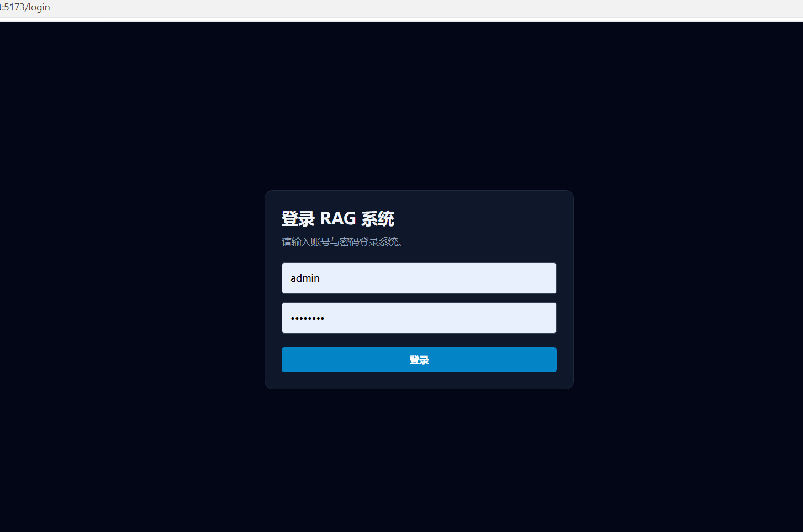

### Smart RAG：证据化回答 + 参考来源 + 纠错引用提示

**1) 整页总览（输入区 + 回答主区域一屏可见）**

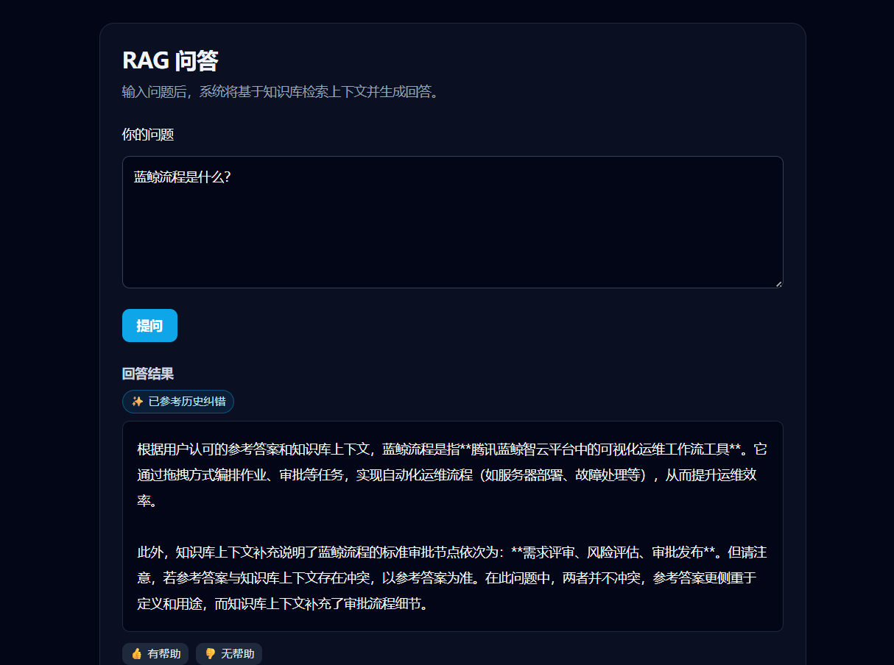

**2) 证据 + 参考来源展开特写（第二张请裁到关键模块）**

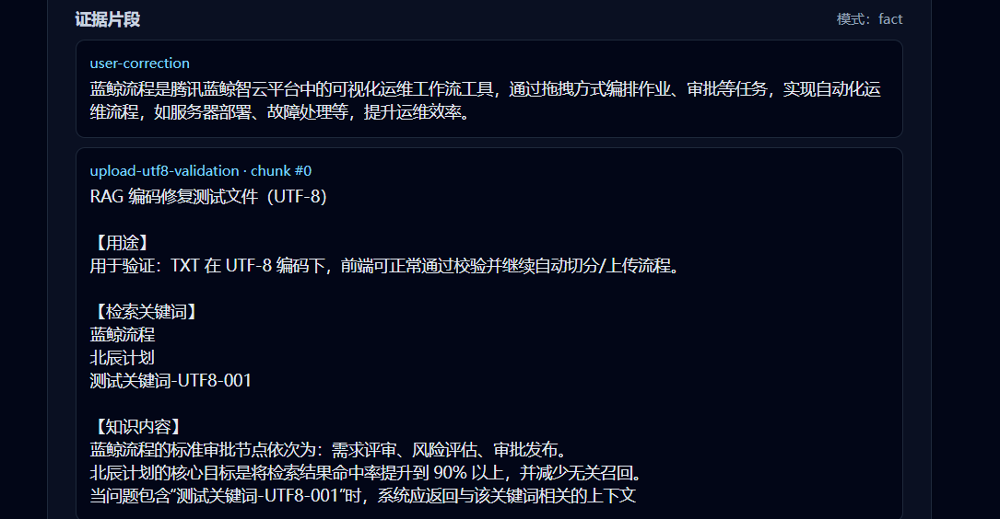

### 多会话聊天：左侧会话列表 + 会话模式流式对话 + 工具状态提示

**1) 整页总览（左侧会话列表 + 右侧对话区同屏）**

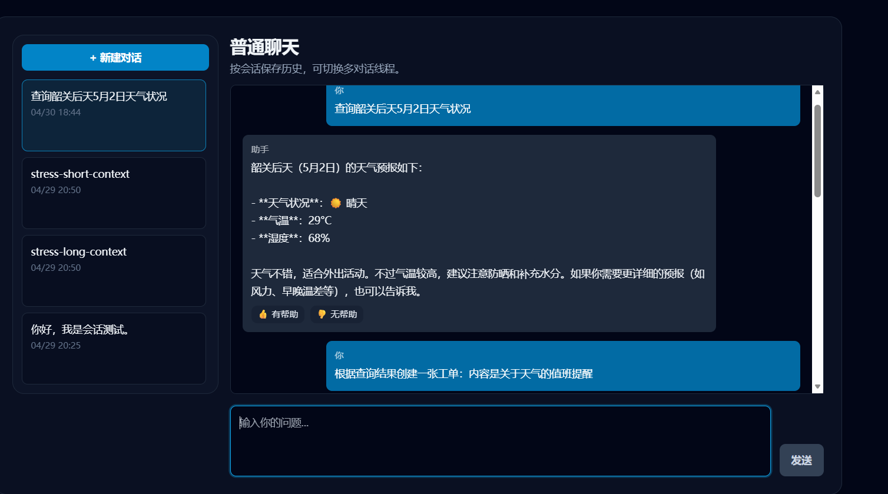

**2) 工具状态气泡特写（🔧 调用工具提示文案完整清晰）**

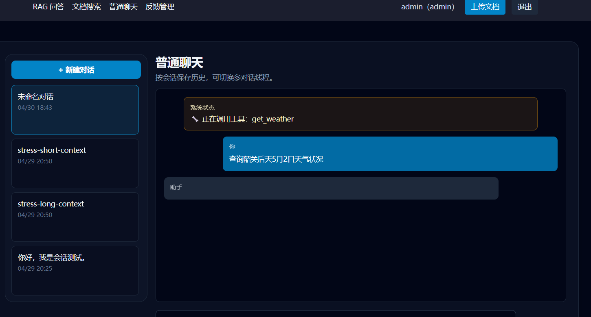

### 反馈闭环：点赞点踩纠错 + 管理员审核启用（enabled）

**1) 列表总览（统计 + 筛选 + 表格表头一屏）**

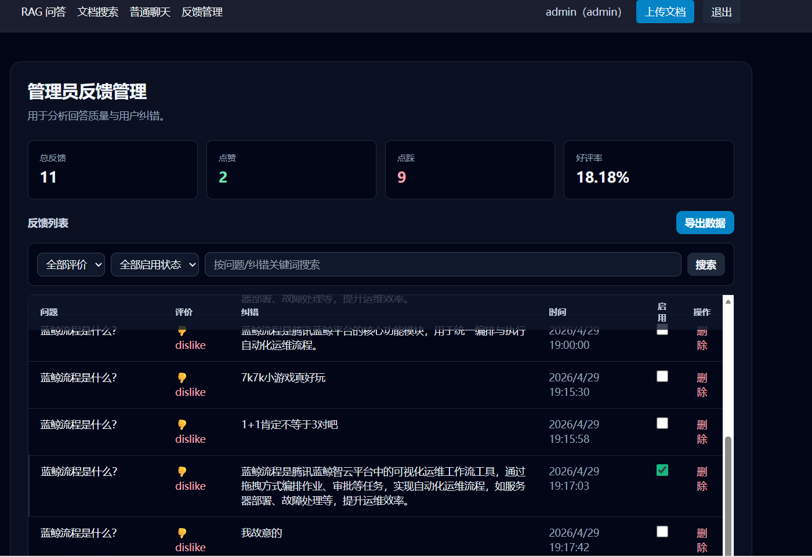

**2) `enabled` 列特写（复选框与行状态对比清晰）**

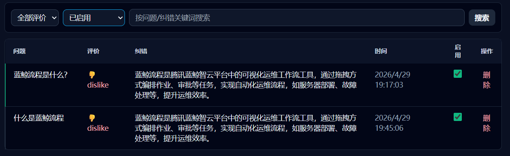

### 知识库上传：管理员上传入口 + 队列/进度与错误提示

**1) 上传弹窗总览（标题 + 选择区 + 主按钮）**

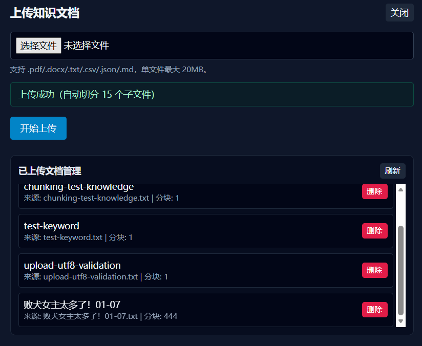

**2) 进度 / 错误提示特写（进度条或红色错误条，文案完整）**

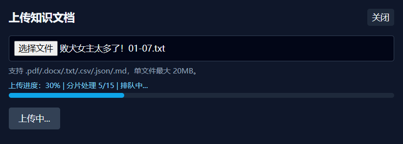

### 飞书群通知：工具 `create_ticket`（兼容 `send_notification`）推送 interactive 卡片

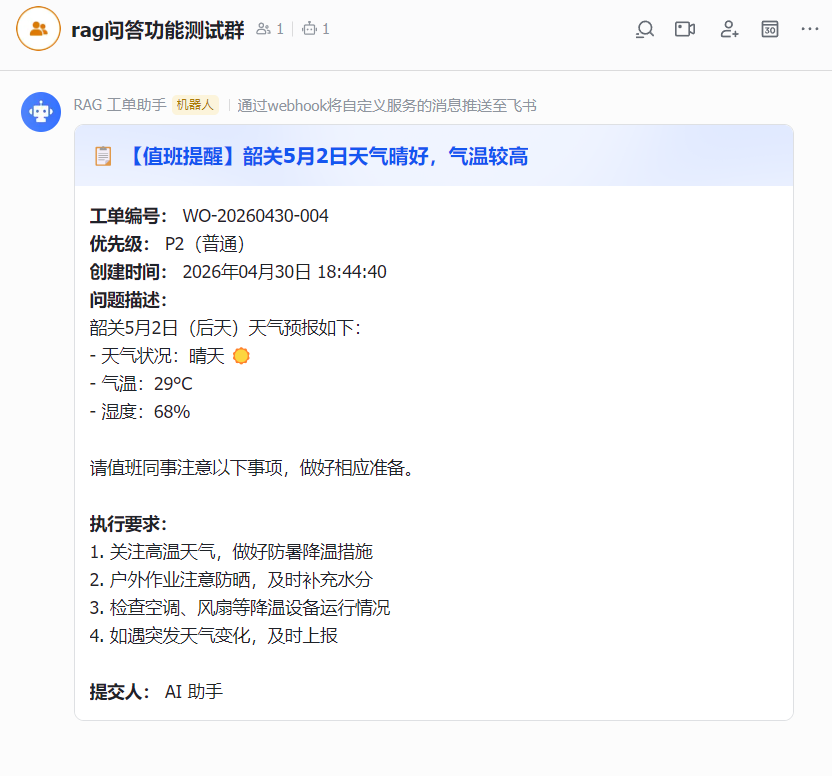

## 📚 目录

- [📌 项目简介](#-项目简介)
- [✨ 核心特性](#-核心特性)
- [🧰 技术栈](#-技术栈)
- [🏗️ 系统架构](#️-系统架构)
- [🚀 快速开始](#-快速开始)
- [🔐 环境变量说明](#-环境变量说明)
- [🧭 使用指南](#-使用指南)
- [📁 项目结构](#-项目结构)
- [🛣️ Roadmap](#️-roadmap)
- [🤝 贡献指南](#-贡献指南)
- [📄 许可证](#-许可证)

> 实现细节与接口清单见：`docs/README.md`

## 📌 项目简介

这是一个基于 `React + NestJS + LangChain` 的全栈 RAG 项目，核心目标是让大模型回答建立在可检索、可解释、可评测的知识库上下文之上。

适用场景：

- 企业内部知识问答机器人
- 运维/客服 SOP 检索与问答
- 低成本私有知识库问答 MVP

## ✨ 核心特性

- **Smart RAG 问答**：低压智能链路（问题类型路由 + 证据化回答 + 上下文限流）。
- **检索透明化**：返回参考来源（标题 + 调整后分数），便于核对“为什么这样答”。
- **反馈驱动优化**：纠错优先（命中历史纠错时提示）+ 检索结果按反馈加权重排。
- **纠错审核闸门**：反馈支持 `enabled` 审核开关；RAG 侧对“已启用纠错”做相关度校验，降低误启用污染。
- **文档语义搜索**：支持关键词与语义召回，返回相关文档标题。
- **多会话聊天**：会话列表 + 新建/切换/删除；服务端持久化；`POST /ai/chat/session` 会话模式流式对话。
- **上下文压缩**：长会话自动摘要早期消息，降低 token 压力并保持连贯（服务端侧）。
- **工具调用与安全**：白名单工具、参数校验、调用日志；聊天中可触发工具并获得“调用中”提示。
- **飞书群通知工具**：优先使用 `create_ticket`（兼容别名 `send_notification`）通过 Webhook 推送 interactive 卡片（支持飞书签名校验）。
- **认证与权限**：JWT 鉴权 + 角色控制（管理员/普通用户）。
- **知识库管理**：管理员可上传、查看、删除知识文档。
- **上传持久化**：已上传文档持久化到磁盘，服务重启后自动恢复。
- **本地 Embedding**：使用本地 BGE 模型，降低第三方 API 依赖与成本。
- **质量闸门**：上传前执行乱码/有效中文比例检测，不合格文档拒绝入库并返回原因。
- **文档元数据缓存**：自动维护章节数、字数、章节标题与全文摘要，支持统计类与全文总结类问题直答。
- **评测基线**：内置 `backend/data/eval-rag-smart.json`（20 题）用于回归验证。

## 🧰 技术栈

### 前端


| 技术           | 说明            |
| ------------ | ------------- |
| React        | UI 渲染与组件化开发   |
| TypeScript   | 类型约束与可维护性     |
| Vite         | 开发服务器与构建工具    |
| Zustand      | 全局状态管理（含认证状态） |
| Tailwind CSS | 原子化样式体系       |
| React Router | 路由与受保护页面      |
| Axios        | HTTP 请求与拦截器   |


### 后端


| 技术                       | 说明                |
| ------------------------ | ----------------- |
| NestJS                   | 模块化后端框架           |
| TypeScript               | 类型安全与工程规范         |
| LangChain                | RAG 链路编排          |
| DeepSeek API             | 大模型推理             |
| HuggingFace Transformers | 本地 Embedding 模型加载 |


### 向量存储


| 组件                | 说明         |
| ----------------- | ---------- |
| MemoryVectorStore | 演示阶段向量检索存储 |


## 🏗️ 系统架构

整体链路：`React 前端 -> NestJS 后端 -> LangChain -> DeepSeek + MemoryVectorStore`

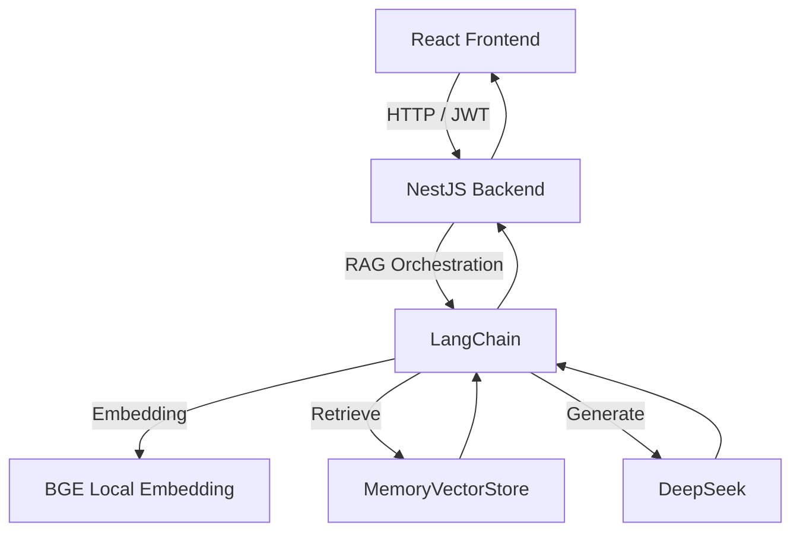


RAG 流程（简化）：

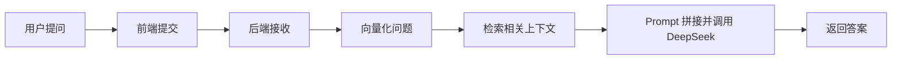


## 🚀 快速开始

### 前置要求

- Node.js >= 18
- npm >= 9
- DeepSeek API Key

### 1) 克隆项目

```bash
git clone <your-repo-url>
cd rag-qa-system
```

### 2) 安装依赖

```bash
cd backend && npm install
cd ../frontend && npm install
```

### 3) 配置环境变量

```bash
cd ../backend
cp .env.example .env
```

至少配置：

- `DEEPSEEK_API_KEY`
- `DEEPSEEK_MODEL`
- `DEEPSEEK_BASE_URL`
- `HF_ENDPOINT`

### 4) 启动后端

```bash
cd backend
npm run start:dev
```

### 5) 启动前端

```bash
cd frontend
npm run dev
```

访问地址：

- 前端：`http://localhost:5173`
- 后端：`http://localhost:3010`

默认账号：

- 管理员：`admin / admin123`
- 普通用户：`user / user123`

## 🔐 环境变量说明

以 `backend/.env.example` 为准：


| 变量名                        | 说明                                                                                                   |
| -------------------------- | ---------------------------------------------------------------------------------------------------- |
| `DEEPSEEK_API_KEY`         | DeepSeek API 密钥                                                                                      |
| `DEEPSEEK_MODEL`           | 模型名称（如 `deepseek-chat`）                                                                              |
| `DEEPSEEK_BASE_URL`        | DeepSeek API 地址                                                                                      |
| `HF_ENDPOINT`              | Hugging Face 镜像地址                                                                                    |
| `PORT`                     | 后端端口（默认 `3010`）                                                                                      |
| `FRONTEND_ORIGIN`          | 前端源地址（CORS）                                                                                          |
| `NOTIFICATION_WEBHOOK_URL` | 飞书/钉钉等机器人 Webhook（`create_ticket` / `send_notification`）                                             |
| `FEISHU_SIGN_KEY`          | 飞书机器人签名校验密钥（当前 `create_ticket` / `send_notification` 实现要求与 Webhook 同时配置；以 `backend/.env.example` 为准） |


DeepSeek API Key 获取：

1. 登录 DeepSeek 开放平台
2. 进入 API Key 管理页
3. 创建并复制密钥到 `.env`

## 🧭 使用指南

### 1. 登录

- 访问 `/login`
- 输入账号密码并登录

### 2. RAG 问答（Smart 模式）

- 访问 `/rag`
- 输入问题并点击提问
- 系统会先进行低压召回（词面 + 向量），再按问题类型（fact/summary/analysis）生成回答
- 返回结果包含证据片段（标题/摘要/chunk）与模式标记，便于判断回答可信度
- 若证据不足，会返回“无法从提供的资料中得到答案”，避免无依据编造

### 3. 文档搜索

- 访问 `/search`
- 输入关键词查看相关文档标题

### 4. 普通聊天

- 访问 `/chat`
- 左侧会话列表管理多线程对话；服务端持久化会话与消息
- 发送消息走会话模式接口（流式 SSE），模型可在需要时触发工具（例如飞书群通知）

### 5. 管理员知识库管理

- 顶部点击“上传文档”
- 选择文件上传（支持 PDF/Word/TXT/CSV/JSON/Markdown）
- 在“已上传文档管理”列表可刷新、删除不需要的文档
- 上传内容会持久化，后端重启后自动恢复到向量库
- 如果文本质量不达标（乱码/疑似编码损坏），上传会被拒绝并显示明确原因与转码建议

## 📁 项目结构

```text
rag-qa-system/
├─ backend/
│  ├─ src/
│  │  ├─ modules/
│  │  │  ├─ ai/            # RAG、搜索、聊天核心逻辑（含 Smart RAG / 工具编排）
│  │  │  ├─ auth/          # 登录、JWT、角色守卫
│  │  │  ├─ upload/        # 上传、列表、删除文档
│  │  │  ├─ conversation/ # 多会话持久化（sessions.json）
│  │  │  ├─ feedback/      # 反馈采集与管理（feedbacks.json）
│  │  │  └─ tools/         # 工具注册与白名单执行（天气 / 飞书通知等）
│  │  └─ main.ts        # 应用入口（CORS、全局异常处理）
│  ├─ data/             # 知识库与上传持久化数据
│  │  ├─ uploaded-documents-meta.json # 文档元数据缓存（章节/字数/摘要）
│  │  ├─ sessions.json                 # 聊天会话持久化
│  │  ├─ feedbacks.json                # 用户反馈持久化
│  │  └─ eval-rag-smart.json          # Smart RAG 评测基线
│  └─ .env.example      # 环境变量模板
├─ frontend/
│  ├─ src/
│  │  ├─ pages/         # 登录、RAG、搜索、聊天页面
│  │  ├─ api/           # API 封装
│  │  ├─ store/         # Zustand 状态管理
│  │  └─ components/    # Header、UploadModal、ProtectedRoute、SessionList
│  └─ vite.config.ts
├─ docs/                # 需求文档与开发计划
└─ docs/screenshots/  # README 预览资源（当前为 SVG 示意图，可替换为真实截图）
```

## 🛣️ Roadmap

- RAG 问答 / 搜索 / 聊天三大基础能力
- JWT 鉴权与角色权限控制
- 管理员文档上传、列表、删除（含中文文件名兼容）
- 上传文档持久化与重启自动恢复
- Smart RAG 低压重构：
  - 结构化回答协议（answer + evidence + meta）
  - 问题类型路由（fact / summary / analysis）
  - 证据约束与无依据降级
  - 上下文长度限流与截断日志
  - 文档元数据缓存与统计类问题直答
- 多会话聊天与会话持久化（服务端 `sessions.json`）
- 反馈闭环：采集、统计、审核启用、纠错相关度校验、检索加权
- 工具编排：白名单、参数校验、调用日志、飞书群通知（Webhook + 签名）
- 向量库替换为生产级后端（Milvus / PGVector / Weaviate）
- 文档切分策略与重排序优化
- 更完整的可观测性与评测面板

## 🤝 贡献指南

欢迎通过 Issue / PR 参与改进。

推荐流程：

1. Fork 并创建功能分支
2. 完成功能开发与本地验证
3. 使用清晰的提交信息
4. 发起 PR，说明变更背景与测试方式

## 📄 许可证

本项目使用 **MIT License**。