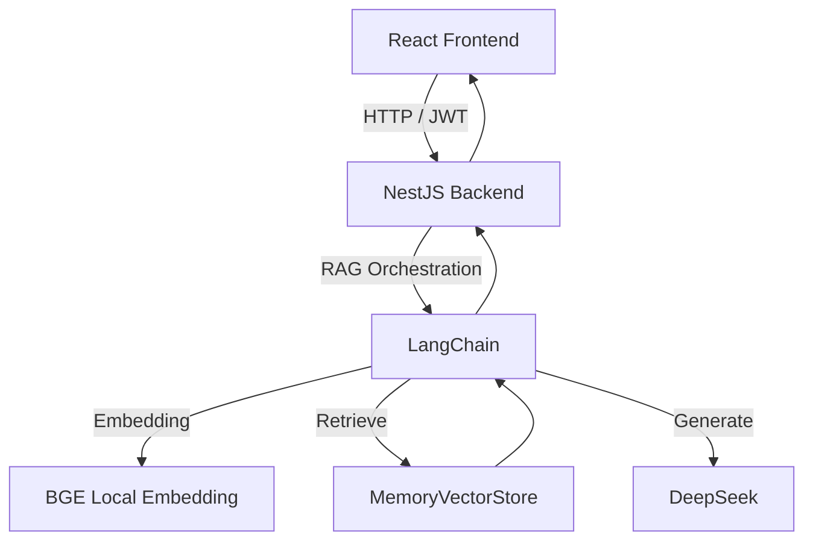

# 智能 RAG 问答系统（实现状态说明）

## 1. 项目概述

本项目是一个前后端分离的 RAG 应用，采用 `React + NestJS + LangChain + DeepSeek + MemoryVectorStore`。

当前目标：

- 基于知识库进行问答与检索，提供可解释回答并减少幻觉。
- 具备可用的登录鉴权、角色权限和知识库管理能力。
- 支持上传知识持久化，重启后自动恢复。

界面预览（GitHub README）：见仓库根目录 `README.md` 的「界面预览」章节；预览资源位于 `docs/screenshots/`（当前为 SVG 示意图，可替换为真实截图）。其中 RAG/聊天/反馈/上传按「总览 + 特写」各 2 张示意，避免单张图信息过密。

## 2. 当前已实现功能（含 Smart RAG 低压重构）

### 2.1 RAG 问答（Smart）

- 支持 `/ai/rag` 问答接口（JWT 保护），返回兼容字段 `answer` + 结构化 `data`。
- 新增 `ragSmart` 能力：`answer + evidence[] + meta{mode, contextCount}`。
- 返回 `sources[]`：展示检索命中的参考来源（标题 + 调整后分数），便于解释检索命中。
- 轻量问题类型路由：`fact / summary / analysis`（不增加额外模型调用）。
- 证据约束后处理：答案与证据重合不足时自动降级为“无法回答”。
- 上下文长度限流（`maxContextChars=10000`）与截断日志。
- 反馈加权检索：点赞/点踩会影响文档片段的检索加权（提升/惩罚）。
- 纠错优先（可控）：命中历史纠错时会提示 `correctionUsed`；并对“已启用纠错”做相关度评估，低相关则自动忽略，避免误启用污染。

### 2.2 文档语义搜索

- 支持 `/ai/search` 关键词检索（JWT 保护）。
- 采用“全库词面优先 + 向量检索兜底”策略。
- 检索结果返回文档标题数组。

### 2.3 普通聊天（SSE）

- 兼容保留：`POST /ai/chat`（messages 数组模式，流式输出）。
- 会话模式：`POST /ai/chat/session`（`sessionId + message`），服务端加载历史、保存用户/助手消息。
- 工具调用：模型可触发白名单工具；工具结果回注后继续生成最终回答。
- 前端聊天页：左侧会话列表 + 新建/切换/删除；工具调用中会显示短暂状态提示（最短可见时长）。
- 长会话压缩：服务端在上下文过长时摘要早期消息（不改写持久化历史，仅影响当次推理上下文）。

### 2.4 用户认证与角色管理

- 登录接口：`/auth/login`。
- 鉴权方式：Bearer Token（JWT）。
- 角色：`admin` / `user`。
- AI 路由需登录访问，上传管理仅管理员可操作。

### 2.5 知识库管理（管理员）

- 上传接口：`POST /upload/document`
- 文档列表：`GET /upload/documents`
- 删除文档：`DELETE /upload/document/:uploadId`
- 支持类型：PDF / DOCX / TXT / CSV / JSON / MD
- 文件大小限制：20MB
- 文本质量闸门：
  - 乱码特征（`�` / `锟斤拷`）检测
  - 中文有效字比例异常检测
  - 不达标直接拒绝入库并返回“原因 + 转码建议”

### 2.6 持久化与恢复

- 上传文档持久化到：`backend/data/uploaded-documents.json`
- 文档元数据缓存：`backend/data/uploaded-documents-meta.json`
- 服务重启时自动加载并重建向量库
- 已支持中文文件名乱码修复（新上传生效）

### 2.7 文档级低压增强（步骤 8）

- 上传分块时写入 `chapterTitle/chapterIndex` 元数据。
- 自动重建文档级指标：`chapterCount/charCount/chapterTitles/globalSummary`。
- 对以下问题启用元数据直答（低压、稳定）：
  - “多少章 / 总章节”
  - “多少字 / 总字数”
  - “总结全文 / 概括全文 / 主角经历”

### 2.8 评测基线

- 新增评测集：`backend/data/eval-rag-smart.json`（20 条）
- 覆盖类型：`fact / summary / analysis`
- 用于每次改动后的回归验证

### 2.9 多会话管理（Conversation）

- `POST /conversation`：创建会话
- `GET /conversation`：列出当前用户会话（不含消息）
- `GET /conversation/:id`：获取会话详情（含消息）
- `POST /conversation/:id/message`：追加消息（如需手工写入）
- `DELETE /conversation/:id`：删除会话
- 持久化文件：`backend/data/sessions.json`

### 2.10 用户反馈（Feedback）

- `POST /feedback`：提交反馈（点赞/点踩/纠错）
- `GET /feedback/stats`：统计（管理员）
- `GET /feedback/export` / `GET /feedback/list`：列表筛选（管理员）
- `PATCH /feedback/:id/enabled`：启用/禁用某条反馈（管理员审核）
- `DELETE /feedback/:id`：删除反馈（管理员）
- 持久化文件：`backend/data/feedbacks.json`

### 2.11 反馈对 RAG 的影响（当前）

- 检索加权：对命中文档片段按历史点赞/点踩进行轻量重排。
- 纠错优先：`findCorrection` 仅使用 `enabled=true` 的点踩纠错；生成前增加相关度评估，低相关自动忽略。
- 透明展示：RAG 返回 `sources`（标题 + 调整后分数）供前端展示参考来源。

### 2.12 工具系统（Tools）

- 工具定义注册 + 白名单执行 + zod 参数校验 + 调用日志。
- `create_ticket`（兼容别名 `send_notification`）：通过 `NOTIFICATION_WEBHOOK_URL` 推送飞书 interactive 卡片；签名密钥使用 `FEISHU_SIGN_KEY`（当前实现要求两者同时配置，详见 `backend/.env.example`）。

### 2.13 脚本与联调

- `backend/scripts/chat-context-stress-test.cjs`：长会话压测（验证上下文压缩与稳定性）。

## 3. 技术栈（当前）

### 3.1 前端

- React + TypeScript + Vite
- Zustand（认证与业务状态）
- Axios（含请求/响应拦截器）
- Tailwind CSS + React Router

### 3.2 后端

- NestJS + TypeScript
- LangChain + DeepSeek
- MemoryVectorStore
- 本地 Embedding：BGE（HuggingFace Transformers）

## 4. 系统架构




## 5. 环境变量（以实际代码为准）

请参考 `backend/.env.example`：

- `DEEPSEEK_API_KEY`
- `DEEPSEEK_MODEL`
- `DEEPSEEK_BASE_URL`
- `HF_ENDPOINT`
- `PORT`
- `FRONTEND_ORIGIN`
- `NOTIFICATION_WEBHOOK_URL`
- `FEISHU_SIGN_KEY`

> 说明：当前实现已不依赖 OpenAI Embedding 配置项。

## 6. 本地运行（当前）

### 6.1 后端

```bash
cd backend
npm install
npm run start:dev
```

### 6.2 前端

```bash
cd frontend
npm install
npm run dev
```

默认端口：

- 前端：`http://localhost:5173`
- 后端：`http://localhost:3010`

## 7. 当前项目状态与后续建议

当前状态：

- MVP 全链路已打通：登录、问答、搜索、聊天、上传、删除、持久化。
- Smart RAG 低压版（步骤 1-8）已完成：结构化回答、证据约束、质量闸门、元数据直答。
- 多会话聊天、反馈闭环（含审核启用）、工具编排与飞书群通知已接入。
- README（根目录）作为 GitHub 展示文档；本文件作为实现状态文档。

后续建议：

- 将向量存储迁移至生产级数据库（Milvus / PGVector）。
- 引入轻量 rerank（可选）提升复杂剧情问题的命中精度。
- 为 `eval-rag-smart.json` 增加自动评测脚本与命中率统计输出。

