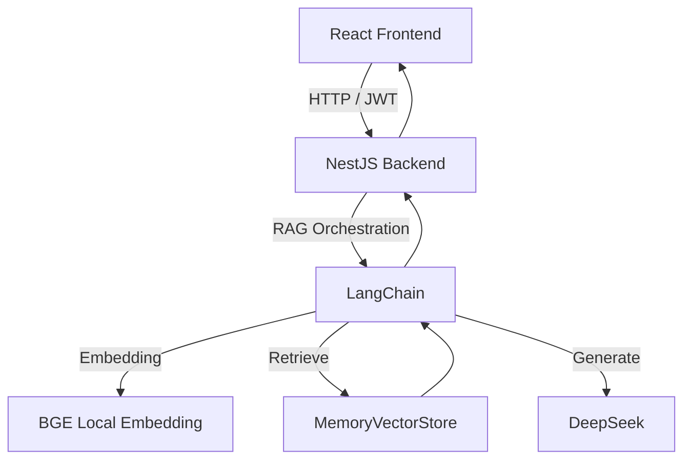

# 智能 RAG 问答系统（实现状态说明）

## 1. 项目概述

本项目是一个前后端分离的 RAG 应用，采用 `React + NestJS + LangChain + DeepSeek + MemoryVectorStore`。

当前目标：

- 基于知识库进行问答与检索，提供可解释回答并减少幻觉。
- 具备可用的登录鉴权、角色权限和知识库管理能力。
- 支持上传知识持久化，重启后自动恢复。

## 2. 当前已实现功能（含 Smart RAG 低压重构）

### 2.1 RAG 问答（Smart）

- 支持 `/ai/rag` 问答接口（JWT 保护），返回兼容字段 `answer` + 结构化 `data`。
- 新增 `ragSmart` 能力：`answer + evidence[] + meta{mode, contextCount}`。
- 轻量问题类型路由：`fact / summary / analysis`（不增加额外模型调用）。
- 证据约束后处理：答案与证据重合不足时自动降级为“无法回答”。
- 上下文长度限流（`maxContextChars=10000`）与截断日志。

### 2.2 文档语义搜索

- 支持 `/ai/search` 关键词检索（JWT 保护）。
- 采用“全库词面优先 + 向量检索兜底”策略。
- 检索结果返回文档标题数组。

### 2.3 普通聊天（SSE）

- 支持 `/ai/chat` 流式输出。
- 前端可实时接收分块回复内容。

### 2.4 用户认证与角色管理

- 登录接口：`/auth/login`。
- 鉴权方式：Bearer Token（JWT）。
- 角色：`admin` / `user`。
- AI 路由需登录访问，上传管理仅管理员可操作。

### 2.5 知识库管理（管理员）

- 上传接口：`POST /upload/document`
- 文档列表：`GET /upload/documents`
- 删除文档：`DELETE /upload/document/:uploadId`
- 支持类型：PDF / DOCX / TXT / CSV / JSON / MD
- 文件大小限制：20MB
- 文本质量闸门：
  - 乱码特征（`�` / `锟斤拷`）检测
  - 中文有效字比例异常检测
  - 不达标直接拒绝入库并返回“原因 + 转码建议”

### 2.6 持久化与恢复

- 上传文档持久化到：`backend/data/uploaded-documents.json`
- 文档元数据缓存：`backend/data/uploaded-documents-meta.json`
- 服务重启时自动加载并重建向量库
- 已支持中文文件名乱码修复（新上传生效）

### 2.7 文档级低压增强（步骤 8）

- 上传分块时写入 `chapterTitle/chapterIndex` 元数据。
- 自动重建文档级指标：`chapterCount/charCount/chapterTitles/globalSummary`。
- 对以下问题启用元数据直答（低压、稳定）：
  - “多少章 / 总章节”
  - “多少字 / 总字数”
  - “总结全文 / 概括全文 / 主角经历”

### 2.8 评测基线

- 新增评测集：`backend/data/eval-rag-smart.json`（20 条）
- 覆盖类型：`fact / summary / analysis`
- 用于每次改动后的回归验证

## 3. 技术栈（当前）

### 3.1 前端

- React + TypeScript + Vite
- Zustand（认证与业务状态）
- Axios（含请求/响应拦截器）
- Tailwind CSS + React Router

### 3.2 后端

- NestJS + TypeScript
- LangChain + DeepSeek
- MemoryVectorStore
- 本地 Embedding：BGE（HuggingFace Transformers）

## 4. 系统架构




## 5. 环境变量（以实际代码为准）

请参考 `backend/.env.example`：

- `DEEPSEEK_API_KEY`
- `DEEPSEEK_MODEL`
- `DEEPSEEK_BASE_URL`
- `HF_ENDPOINT`
- `PORT`
- `FRONTEND_ORIGIN`

> 说明：当前实现已不依赖 OpenAI Embedding 配置项。

## 6. 本地运行（当前）

### 6.1 后端

```bash
cd backend
npm install
npm run start:dev
```

### 6.2 前端

```bash
cd frontend
npm install
npm run dev
```

默认端口：

- 前端：`http://localhost:5173`
- 后端：`http://localhost:3010`

## 7. 当前项目状态与后续建议

当前状态：

- MVP 全链路已打通：登录、问答、搜索、聊天、上传、删除、持久化。
- Smart RAG 低压版（步骤 1-8）已完成：结构化回答、证据约束、质量闸门、元数据直答。
- README（根目录）作为 GitHub 展示文档；本文件作为实现状态文档。

后续建议：

- 将向量存储迁移至生产级数据库（Milvus / PGVector）。
- 引入轻量 rerank（可选）提升复杂剧情问题的命中精度。
- 为 `eval-rag-smart.json` 增加自动评测脚本与命中率统计输出。

